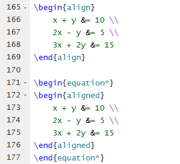

# update

当使用`align`或`align*`环境时，默认情况下会生成行号(line165-ling169)。如果您不希望显示行号，可以使用`align`或`align*`环境的变体`aligned`(line171-ling177)。以下是一个示例：

在上述示例中，使用了`equation*`环境作为外部包装，用于生成一个不带行号的居中公式。在其中嵌套了`aligned`环境来生成多行公式，并且没有显示行号。

通过使用`aligned`环境，您可以避免显示行号，同时实现多行公式的对齐。